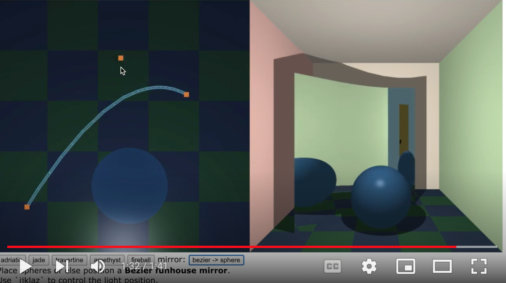
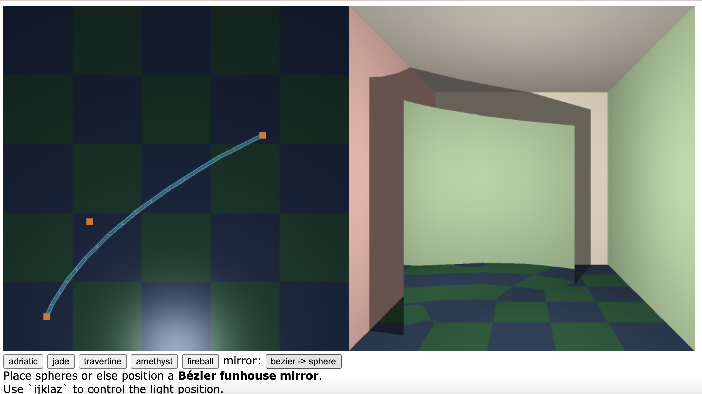
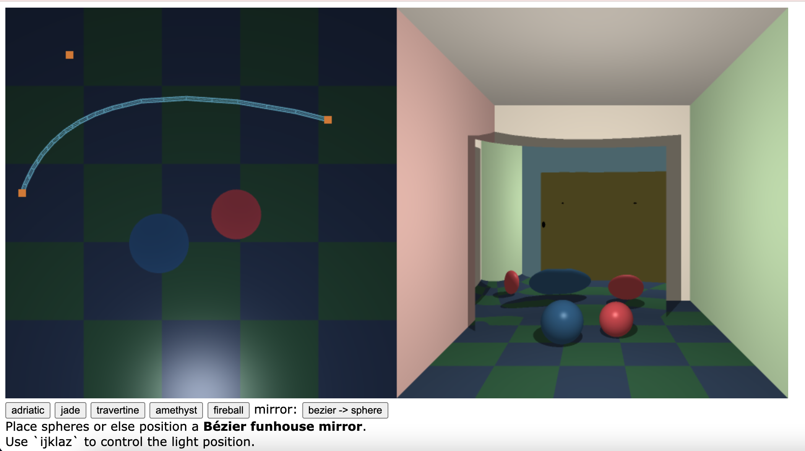
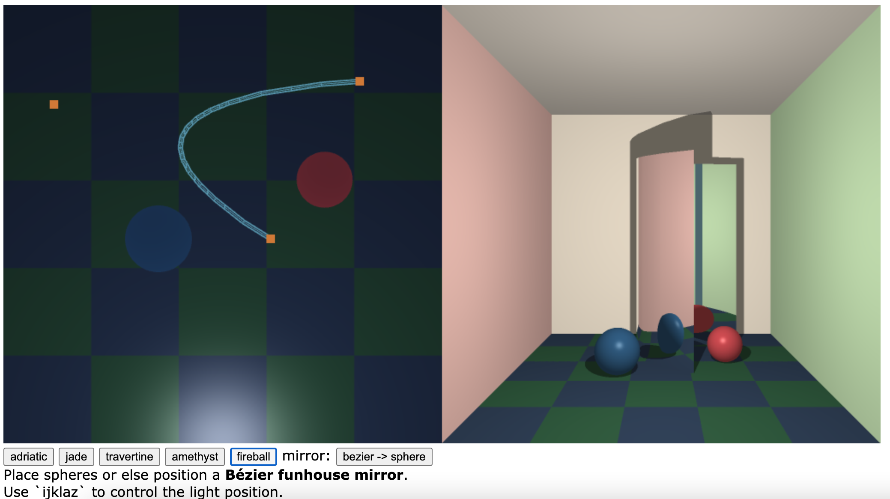

# CSCI 385 Program 4: Bezier Funhouse :clown_face:

## Running the Funhouse

To run the funhouse and interact with the mirrors, open the repo and run the command `open bezier-fucnhouse.html`. The program will then open in your browser!

## Live Demo

## Design Overview

### Part 1: Editor Curve :computer_mouse:

The editor curve is calculated in `funhouse.js`. The class `Curve` contains the function `compile()` takes an array of the three control points and generates an array of bezier curve points using the function `bezier_points`. This is a recursive function. First it checks if the points are a smooth enough approximation of the curve by calling `in_range`. If not the points are split into the mid points and the mid points of the mid points.

Fig.1 - The initial editor curve

Fig.2 - The scene with balls reflected

### Part 2: Ray Tracing the Mirror :mirror:

Similar to the editor curve, the points on the mirror are chosen via a recursive algorithm. However recursion is not allowed in GLSL so it must be implemented manually by having `rayIntersectBezier` call `rayIntersectBezier1` twice, once with with control points `(L0, L1, L2)` and once with control points `(R0, R1, R2)` each of these calls returns an `ISect` and the better of the two (determined by calling `bestISect`) is returned. `rayIntersectBezier1` implements the same algorithm but instead calls `rayIntersectBezier2` which calls `rayIntersectBezier3` which calls `rayIntersectBezier4`. In `rayIntersectBezier4` the helper function `calcIntersection` is called. This function calls `rayIntersectPanel` twice, once passing `(p0, p2)` and then passing `(p2, p0)`. This allows the mirror to be reflective on both sides.

Fig.3 - Double sided mirror

`rayIntersectPanel` first calculates a normal to the plane that passes though the 2 control points and is perpendicular to the floor. It then calls `rayIntersectPlane` to find the intersection of this plane. The intersection is returned it if is in between the end points of the panel.

After `calcIntersection` receives the `ISect` from `rayIntersectPanel` it linearly interpolates the normal of the `ISect` as an affine combination of the normals between the control points.

### Part 3: Shadows :dark_sunglasses:

The function `rayHitsBezierBefore` returns `true` if shooting a ray from point `R` in a direction `d` hits a Bezier mirror before traveling a given `distance`. This is calculated by generating an `ISect` by calling `rayIntersectBezier` and comparing the `distance` attribute of the `ISect` to `distance`.