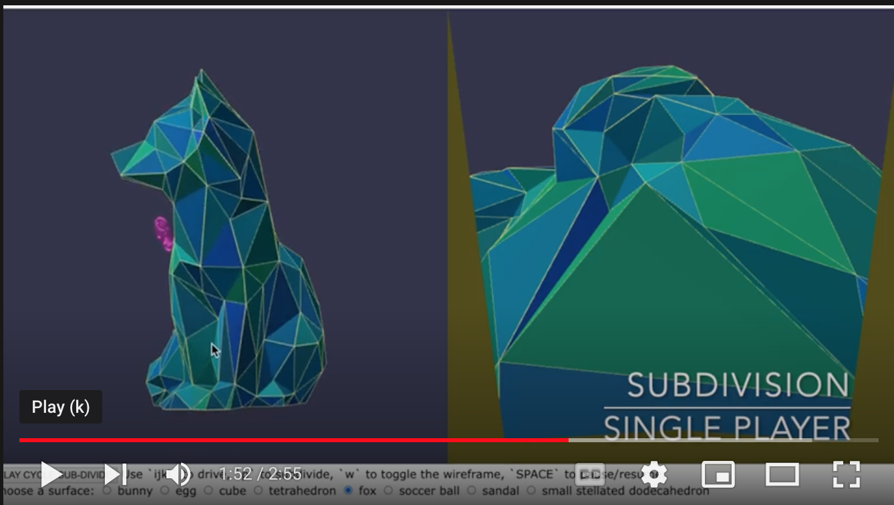
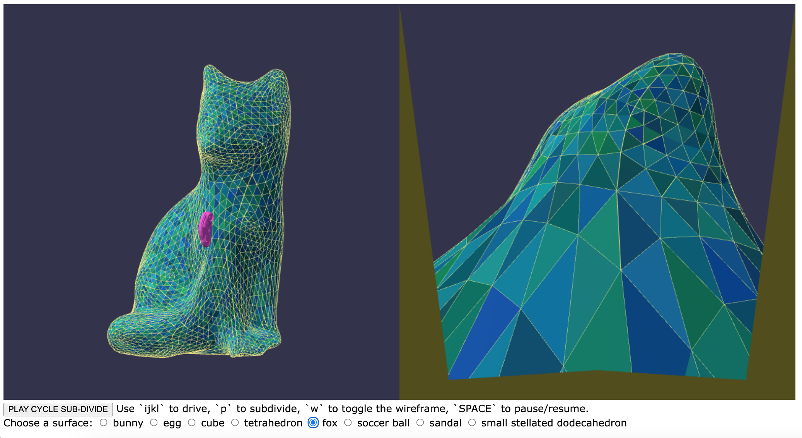
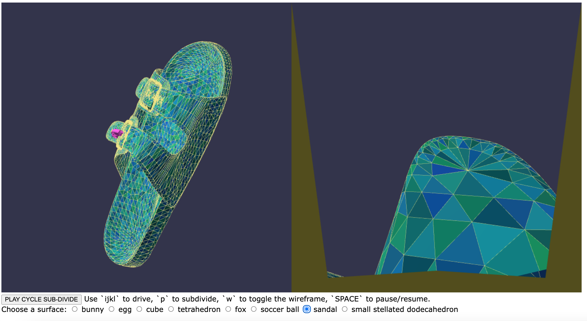
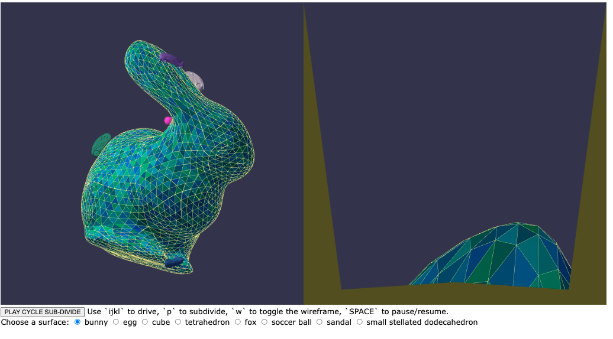
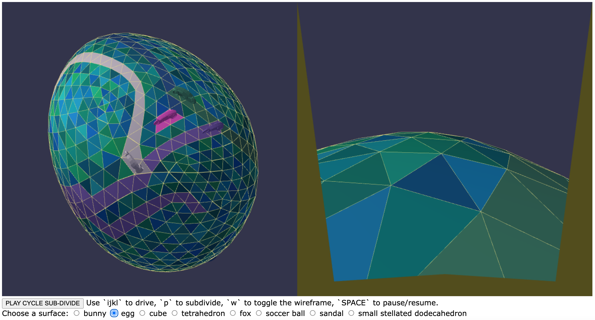
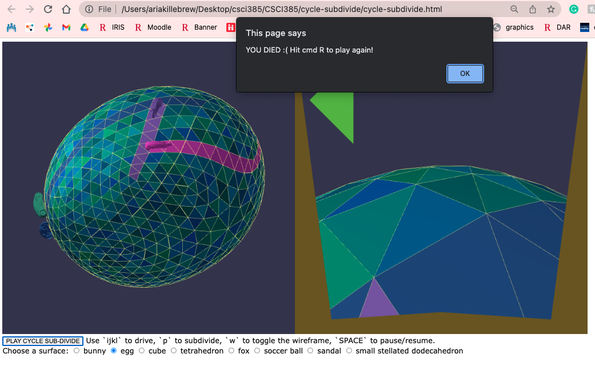

# CSCI 385 Program 5: Cycle Subdivide :motorcycle:

## Running the Simulation

To run the simulation and play the game clone the repo. In your terminal navigate to the directory and run the command `open cycle-subdivide.html`. Press `p` to subdivide the surface and use the `i`, `j`, `k`, and `l` keys to control the cycle.


</p>
<p align = "center">
Fig.1 - The default subdivision surface
</p>

## Live Demo
[](https://youtu.be/PA2cEEQzDbM)
## Design Overview

### Part 1 Loop Subdivision :heavy_division_sign:

First I wrote the subdivision code such that no smoothing was performed but the topology of the new vertices, edges, and faces was correct. This was fairly straight forward. The new vertices were calculated and `v.clone` was updated for the existing vertices and `e.split` was updated for the midpoints. The new faces were calculated by using these points, see below.

```
             v1.clone
                / \
               / 1 \
              /     \
      e1.split-------e0.split
            / \     / \
           / 2 \ 3 / 0 \
          /     \ /     \
  v2.split----e2.split---v0.clone
```

Once the topology was correct I recalculated the cloned vertices and the edge splits. The splits are are a weighted average of the 4 points that surround it (see below) given by the equation `s = 3/8 p0 + 3/8 p1 + 1/8 q0 + 1/8 q1`.

```
   q0
   / \
  /   \
 /     \
p0--s--p1
 \     /
  \   /
   \ /
    q1
```

The clones were more complicated since we need to know how many vertex neighbors the vertex has. This was determined with the following loop

``` java
        var k = 1;
        var first = v.edge.target;
        var current = v.edge.prev.twin;

        while (current.target != first) {
            k += 1;
            current = current.prev.twin;
        }
```

Beta was calculated as `var b = (5/8) - (3/8 + (1/4)*Math.cos(2*Math.PI/k))**2;`. Then the summation of the weighted averages of all the neighbors was calculated as follows

``` java
        var i = 1;
        var sumx = 0.0;
        var sumy = 0.0;
        var sumz = 0.0;
        current = v.edge;
        while (i <= k) {
            sumx += (b/k) * current.target.position.x;
            sumy += (b/k) * current.target.position.y;
            sumz += (b/k) * current.target.position.z;
            current = current.prev.twin;
            i+=1;
        }

        var sx = (1 - b) * v.position.x + sumx;
        var sy = (1 - b) * v.position.y + sumy;
        var sz = (1 - b) * v.position.z + sumz;
```

The smooth vertices were used as the vertex clones and edge splits to create a proper subdivision.


</p>
<p align = "center">
Fig.1 - A smooth fox!
</p>


</p>
<p align = "center">
Fig.2 - A smooth sandal just in time for summer!
</p>

## Part 2: Multiple Cycles Game Extension :video_game:

For my extension I implemented multiple cycles and included and endgame. To do so I created two subclasses of `Cycle` called `PlayerCycle` and `AutoCycle`. Both subclasses add a `this.id` method to the constructor. Additionally I added a `this.cycle` attribute to the `Face` class in `subdivide.js`. This attribute allows a face to keep track of which cycle has visited it.

 Both classes extend the `update()` method of the `Cycle class` to check if the face the cycle just entered has already been visited by another cycle by comparing a `this.id` to `this.face.cycle`. If so the cycle dies and for the `PlayerCycle` an alert is given to the user that they have died. For `AutoCycle` the `steer()` method is overwritten to randomly pick a steering direction, rather than take input form the user.

 In `cycle-subdivide.js` when the `p` key is hit a call is made to the `resetCycles()` method which makes two calls are made to additional methods in `cycle.js`. First, a  call is made to the `removeCycles()` method which removes all cycles form the `gCycle` list. Then a call to `initCycles()` is made to place new cycles on the surface.

 
</p>
<p align = "center">
Fig.3 - Initial configuration in multiplayer game
</p>

 
</p>
<p align = "center">
Fig.4 - Multiplayer game
</p>

 
</p>
<p align = "center">
Fig.5 - Endgame in multiplayer game
</p>