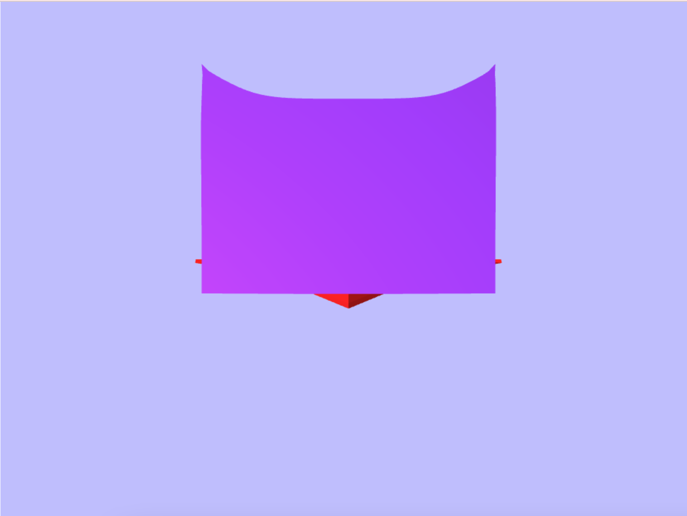
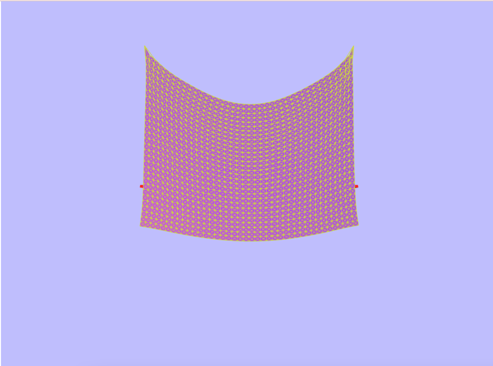
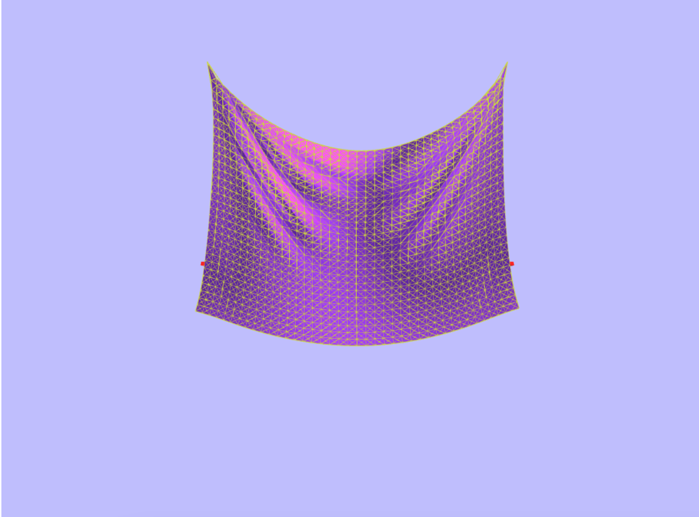
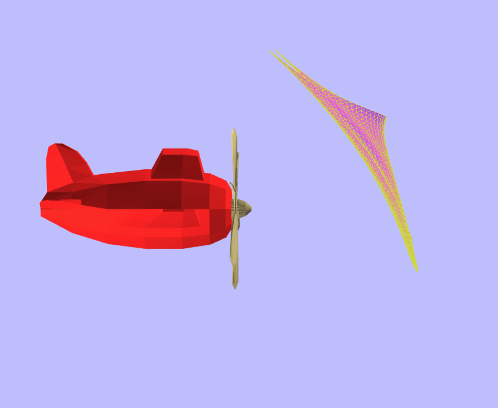
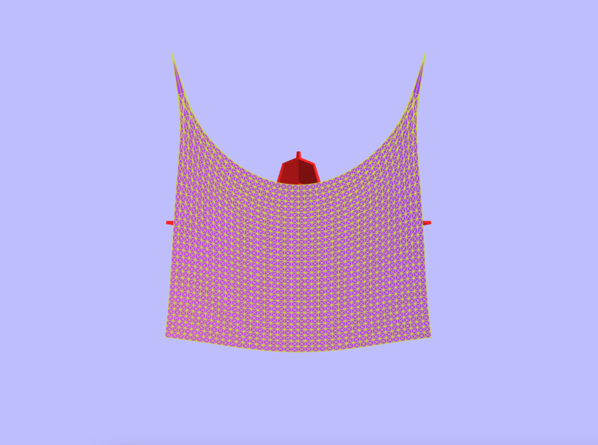
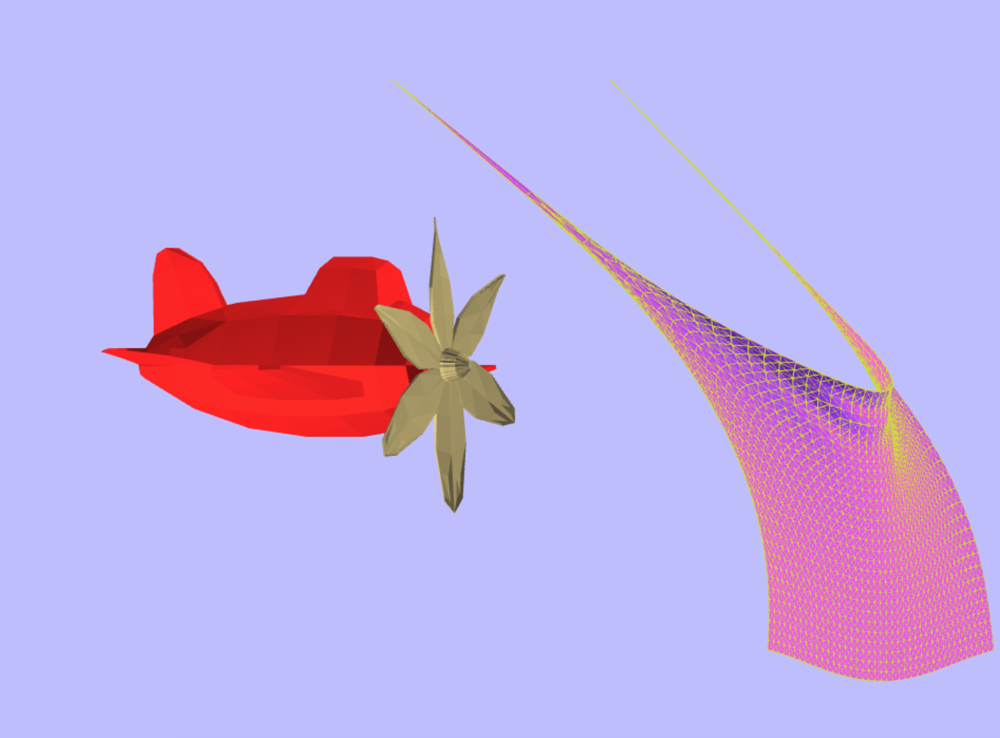

# CSCI 385 Program 6: ONE-SHEET :kite:

## Running the Simulation

To run the simulation clone the repo, navigate to your local copy and run `open one-sheet.html`. The sheet will appear and you can experiment with wind and constraints!


</p>
<p align = "center">
Fig.1 - The default sheet
</p>

## Design Overview

Part 1: Connecting the Masses :handshake:

In order to simulate the movement of the cloth each mass must be connected to its north, south, east, and west neighbors, its diagonal neighbors, and its north south east and west neighbors who are 2 away. When I first connected the masses I looped through the rows and columns and used `getMass(r, c)` to get each mass and connect it to its appropriate neighbors.

However I later realized that doing this would cause everything to be doubly connected. You would connect mass1 to its east neighbor mass2 and then connect mass2 to its west neighbor mass1. To prevent this I only connect each mass to its south and east neighbor, its northeast southeast neighbor, and its south and east neighbors two away.

```
  /mne
 /
m1---me
|\
| \mse
ms
```


</p>
<p align = "center">
Fig.2 - The default sheet with the mesh
</p>

Part 2: A Step in the Simulation :footprints:

A step in the simulation requires computing the masses position and velocity at time `t+h` given its position and velocity at time `t`. This is done following the standard algorithm

`P(t + h) = P(t) + hV(t)`
`V(t + h) = V(t) + hAcceleration`

However when this step is done we must have saved the previous positions and velocity by calling `saveState()` in the `update` function. `saveState()` simply sets `this.prevPosition` to `this.position` and `this.lastVelocity` to `this.velocity`. This function is also called in `reset()` so that when the user resets the simulation the saved states are correct.

Part 3: Acceleration :racing_car:

The `computeAcceleration` function finds the acceleration of a mass. The force is computed by looping through all the springs attached to that mass and summing the force from the spring, then we add the force of gravity, the force of wind (if it is blowing), and the drag . Once the force is computed we divide force by the mass to get acceleration.

Part 4: Force of the Springs :fishing_pole_and_fish:

The `computeForce` function uses Hooke's law to find the force of the spring between two masses. We first find the `distance` between the two masses and then compute the `difference` between that distance and the resting length to see if the spring is too short or too long. Then we get the unit vector between the two masses and compute the final `force` as the product of the unit vector and the `stiffness` of the spring and the `difference`.


</p>
<p align = "center">
Fig.3 - A gentle breeze
</p>

Part 5: Correcting Integration :bar_chart:

The original `computeStep` leads to instability in the cloth and it will quickly become out of control. To correct this we update `saveState()` so that it tracks `this.prevPrevPosition` in addition to `this.prevPosition`. `velocity` this calculated as `this.prevPosition - this.prevPrevPosition` and `position` is calculated as `this.prevPosition + velocity * timeStep + acceleration * timeStep^2`. Note that we no longer track the `velocity` of a mass, `velocity` is only used for computing the next position.


</p>
<p align = "center">
Fig.4 - A gentle breeze, side view
</p>

Part 6: Constraining the Movement :chains:

Once the integration is fixed the sheet is stable but it will slowly drip off the screen like taffy. To fix this we must modify the masses position if the spring connecting two masses stretches beyond the `restingLength * gDeformation`. This is done as follows:

1) compute the `length` of the spring connecting the masses
2) if `length` > `restingLength * gDeformation` find the `difference`between the two, the vector going from `mass1` to `mass2` (`vect1`), and the vector going from `mass2` to `mass1` (`vect2`)
3) if one of the masses is `fixed` move the other mass by adding `vect1 * difference` (or `vect2`) to its position
4) otherwise move each mass by adding `vect1 * (difference / 2.0)` (or `vect2`) to its position


</p>
<p align = "center">
Fig.5 - An unconstrained front view
</p>


</p>
<p align = "center">
Fig.6 - An unconstrained wind
</p>


