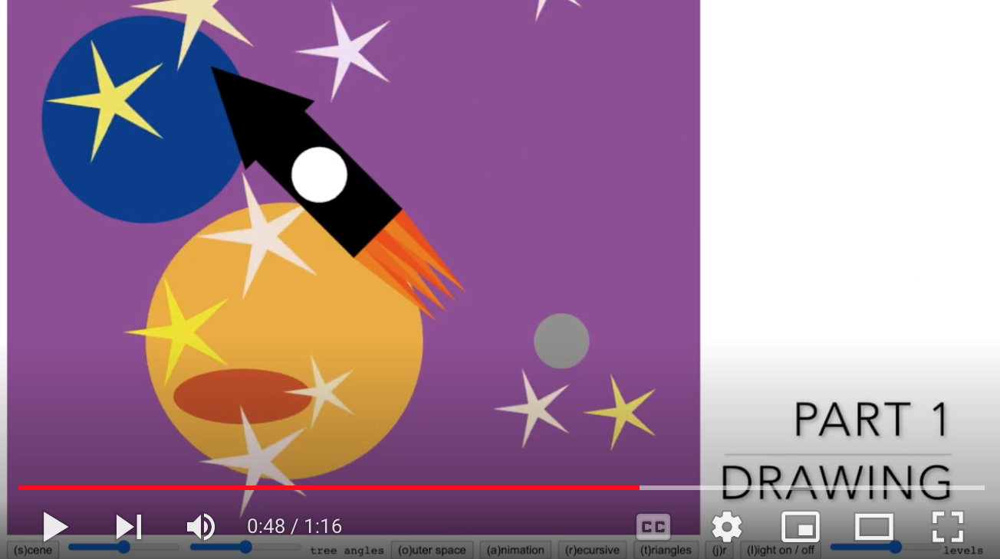
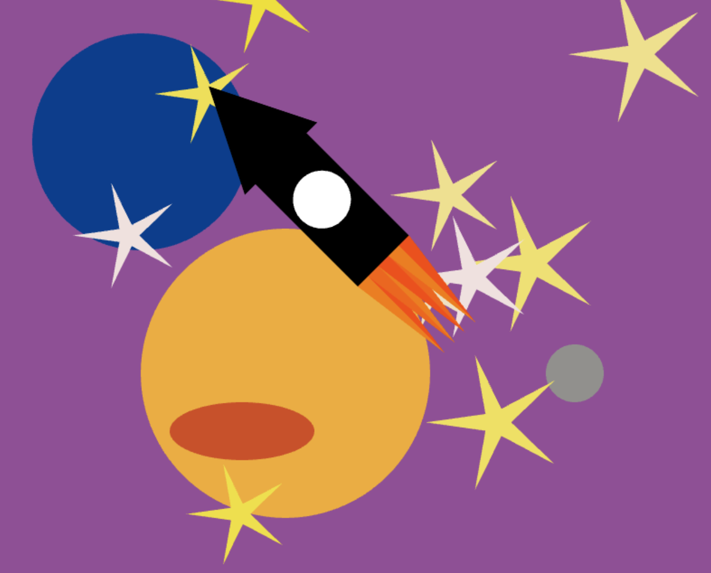
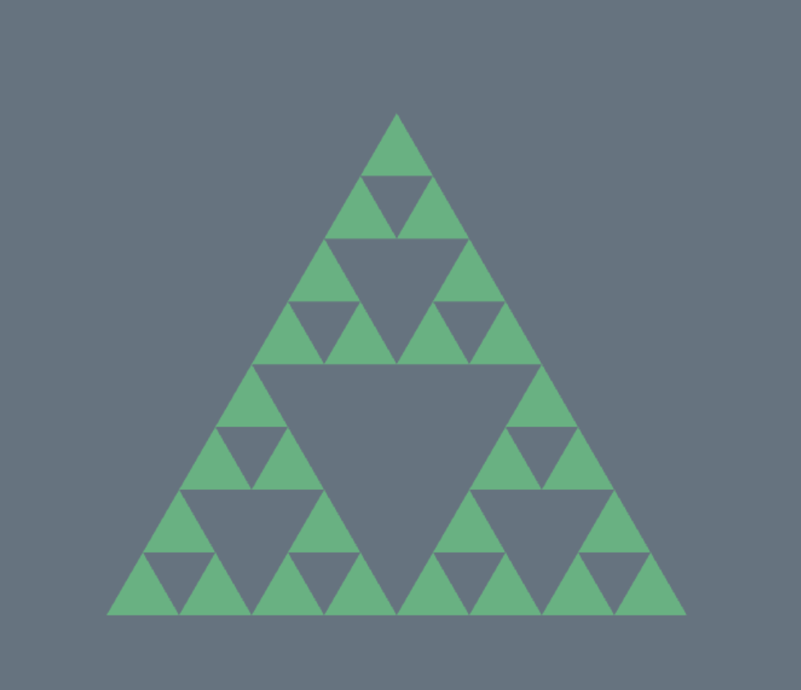
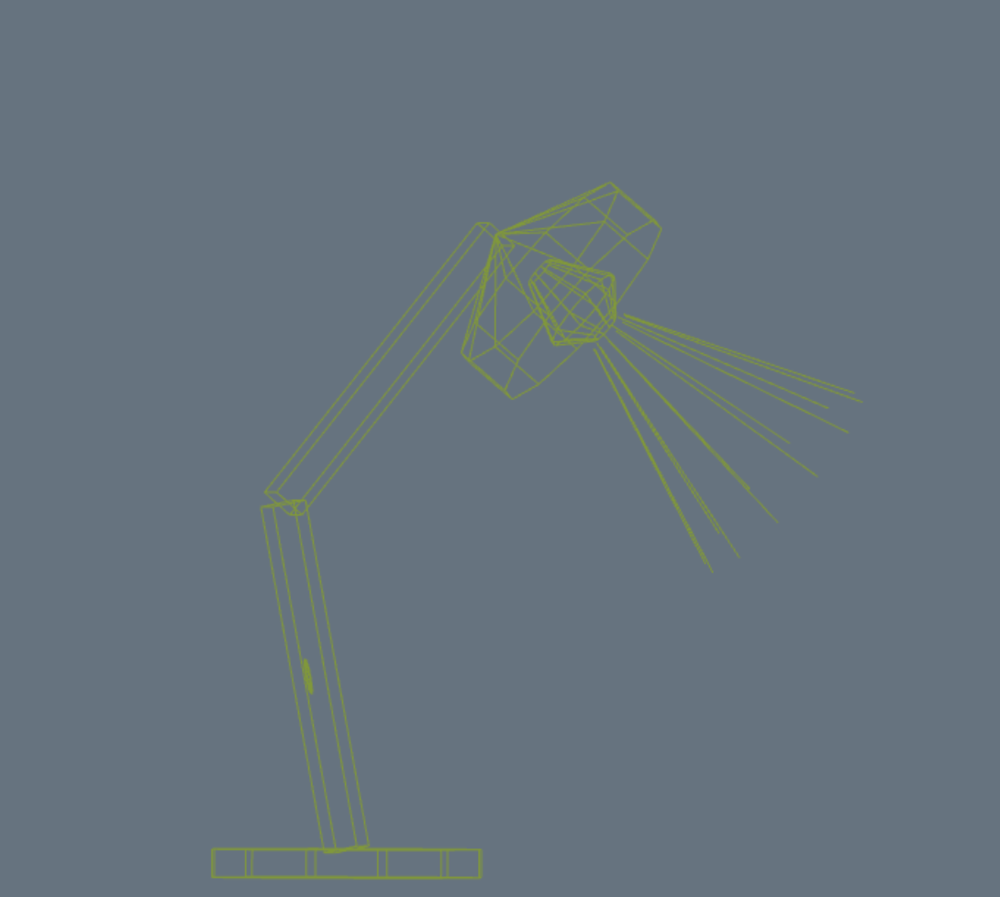

# CSCI 385 Program 2: Scene

## Running the Scene

To run the scene and see the various components in action clone this repo, open the and run the command `open scene.html`. The program will then open in your browser!

## Live Demo

[](https://youtu.be/-3DUvC5bPxE?t=39)


## Part 1: Drawing :framed_picture:


### Design

Before I started the drawing I generated 3 random lists, `randomX`, `randomY`, and `randomScale`. This was done in `main()` rather than `drawSpace()` since the image is redraw approximately 60 times per second, so doing these calculations in `drawSpace()` made the stars look like they moving all over the page.

The stars are drawn twice to give a sense of dimension to the image. In the first loop the color, positioning, and size is given by
``` javaScript
        let randomColor = Math.random();
        glColor3f(0.937, 0.882, 0.0 + randomColor);
        glPushMatrix();
        glRotatef(180 * randomScale, 0.0, 0.0, 1.0);
        glTranslatef(randomX[i], randomY[i], 0.0);
        glScalef(randomScale[i], randomScale[i], randomScale[i]);

        STAR()
        glPopMatrix();
```

After the planet and rocket is drawn more stars are place, the positioning and scale is modified so the new stars are not in the same position as the originals:
```javaScript
        let randomColor = Math.random();
        glColor3f(0.937, 0.882, 0.0 + randomColor);
        glPushMatrix();
        glTranslatef(randomX[(i + 5) % 10], randomY[(i) % 10], 0.0);
        glScalef(randomScale[i] * 2, randomScale[i] * 2, randomScale[i] * 2); // so new stars are not in position of initial stars
        STAR()
        glPopMatrix();
```

The planets are simply scaled circles and the rocket is a combination of a square, a circle, and some triangles.

## Part 2: Recursive Drawing 	:cyclone:



### Design

The Sierpinski triangles are drawn by recursively calling the ` drawTripinski(levels)` function. On each call the coordinate matrix is scaled by `0.5` in all directions. Then it is shifted by `0.5` to the right / left or shifted up by `Math.sqrt(3) / 2` up and the recursive call is made.

## Part 3: Animation :bulb:


### Design

The lamp is draw out of 6 wire-frame objects which are scaled and rotated accordingly. The base and switch are made of a `WireNPolygon`, a `N` sided regular prism. Each arm is made of a `WireCube`. The shade is constructed from a `WireNPolygon` and a `WireNPyramid`, a pyramid with `N` sides. The bulb is made from two `WireNTruncatedPyramid`s. Finally, the light rays are made from  `WireLightRays` which simply just the sides of the `WireTruncatedPyramid`.

The animation is done by varying the `baseAngle`, `hingeAngle`, and `shadeAngle`. When the lamp is animated the light turns off. When the animation is paused (press the j key again) the light turns on.

### Notes

The lamp offers a fun optical illusion! Pause the animation and guess which direction the lamp shade is facing. Then drag the image to check. My roommate and I got in many arguments about this!