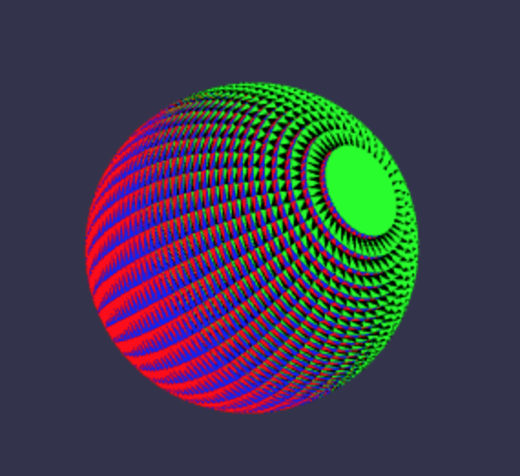
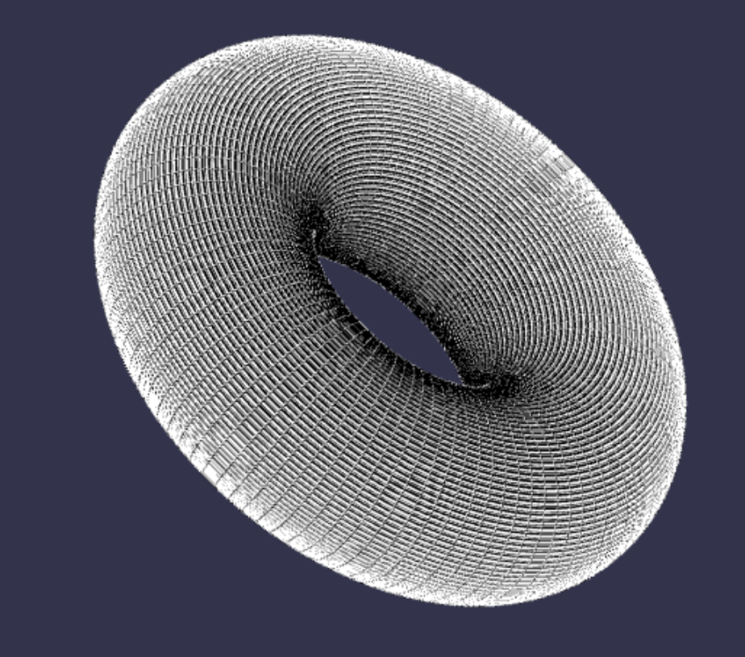
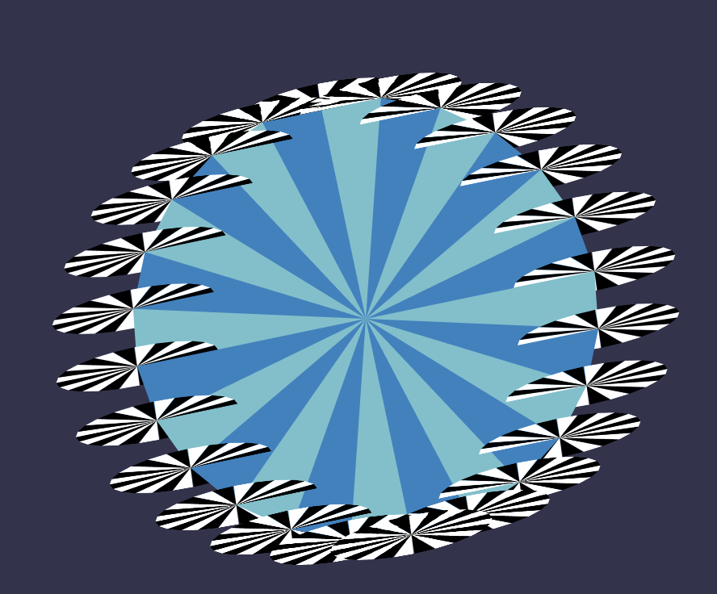

# CSCI 385 Program 1: Showcase

## Part 0: Increasing and Decreasing Smoothness :sparkles:

To increase or decrease the smoothness of the sphere, torus, lasagne, or stars, the `numFacets` parameter is increased or decreased by `20` and the function `makeSmoother()` is called. This function increases simply redraws each of these figures. Since their smoothness is determined by `numFacets` they become more or less smooth.

## Part 1: Sphere :crystal_ball:

### Design

I created the sphere by modifying the existing `makeCylinder()` coded. First I created a cylinder with sides that consisted of `numFacets` thin bands. I used the `getY()` helper function to determine the vertical position of these bands. I then varied the radii of the bands by changing the z position of the individual facets of the band as follows `z =  width / numFacets + (1/numFacets) * 2 * i` where `i` ranges from `0` to `numFacets` depending on which band is being drawn. Finally I created the green and black horizontal portions to connect the layers. This was done by drawing two triangles between a triangular facets on one band and the corresponding facets on the band above it.

### Notes

At the beginning of this assignment I was not conscious about reusing the sections of code where I compute the sine or cosine of an angle to find the positioning of a point. This caused my laptop to run quite slow and made the fan go crazy. Once I changed my code so I was computing these numbers once and simply adding to them or multiplying them to find various points things ran much smoother.

## Part 2: Torus :doughnut:

### Design

To make the torus I made a base disk in the center, similar to the top of the cylinder. Then I created smaller disks which were spaced evenly around the circumference of the center disk (see below). Then I angled the disks in so they were parallel to the lines radiating form the center of the base disk. Once these were in place I simply connected each disk to the one in front of it.

### Notes

Rotating the smaller disks in was the hardest part of this assignment for me. It took me some time to realize that I had to rotate the disks around the y-axis. To do so I had to dig deep into my trig memories form highschool. As with the sphere I was careful in doing these sine and cosine calculations so that I could reuse the numbers I found to make my code run more efficiently.

## Part3: Surface of Rotation :star2:

### Design

The basic idea of the star spiral is similar to the torus. First I created a flat star object. I then places it at even increments around the circumference of the base disk. Then I rotated the stars in and connected each star to the one after it. To make the stars spiral up I increased the y coordinate each time I created a new star.

### Notes

Getting the positioning and rotation of the star was slightly more complicated that just the torus since the star is made by doing 5 loops where on each loop a v-shaped section of the star is made out of two triangles that are made out of 4 points.

There is also a button to increase of decrease the tightness of the spiral. Tightening the spiral all the way gives bonus rontini!

## Part 4: Pasta :spaghetti:

### Design

I decided to make a lasagne noodle as my pasta shape. The design is fairly straight forward. The center section is simply a rectangle. The wavy sides are made out of quarter spheres which alternate being rotated 180 degrees around the x axis. Since there are more parts of this shape I created a `makeLasagne()` function that calls `makeLasagneBase(len, width, height, radius)` (for the center rectangle) and `makeQuarterSpheres(x, y, z, radius, len)` (for the sides). I took care to make sure that the spheres would divide evenly into the base of the noodle by parameterizing the helper functions.

